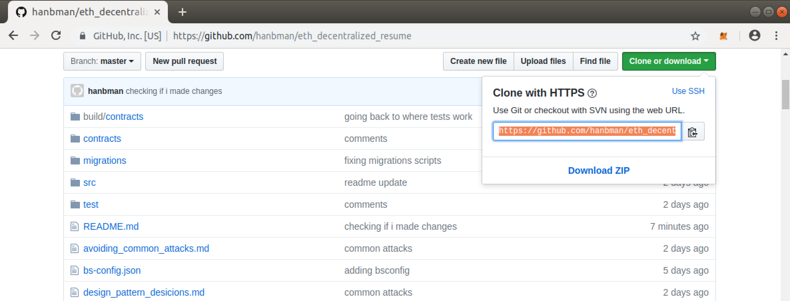
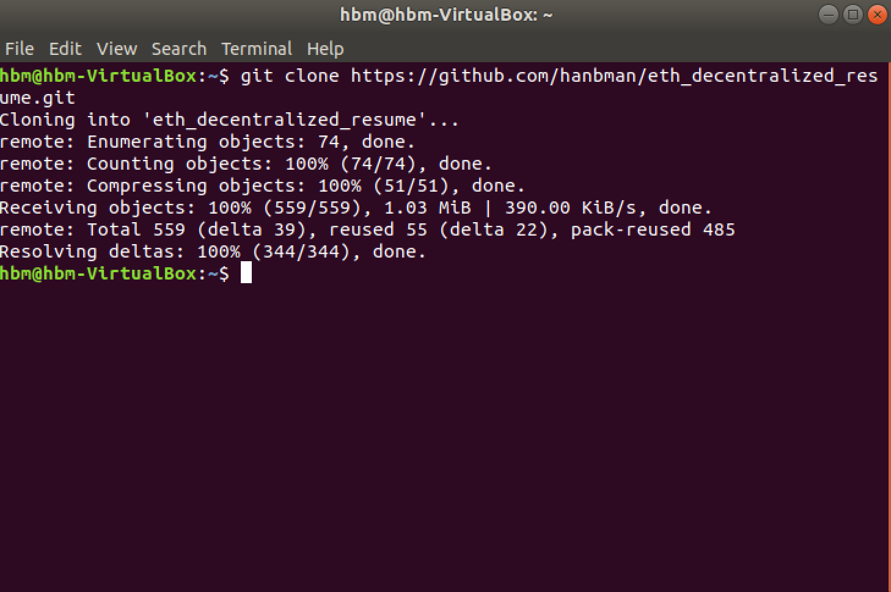
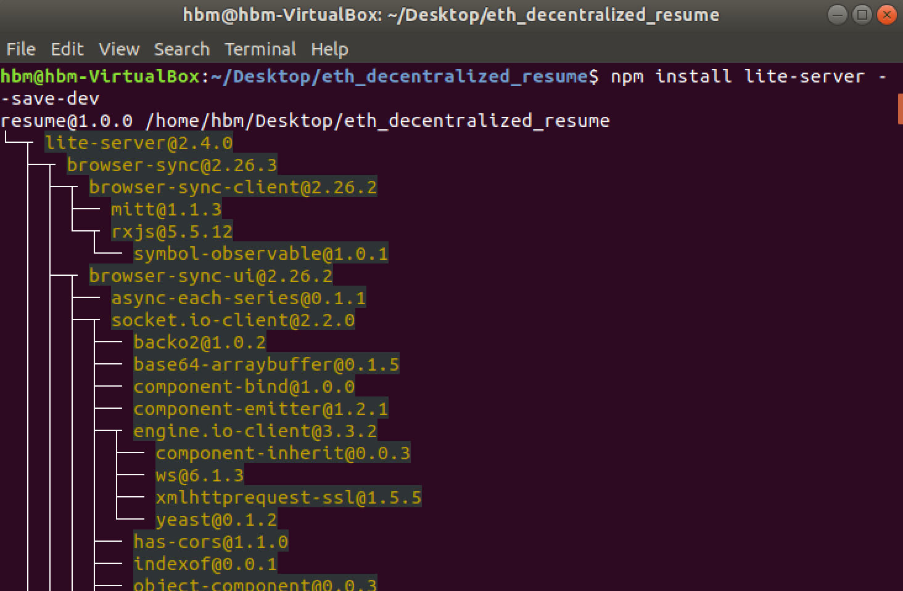
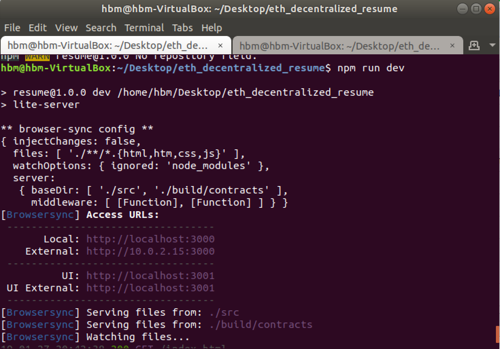
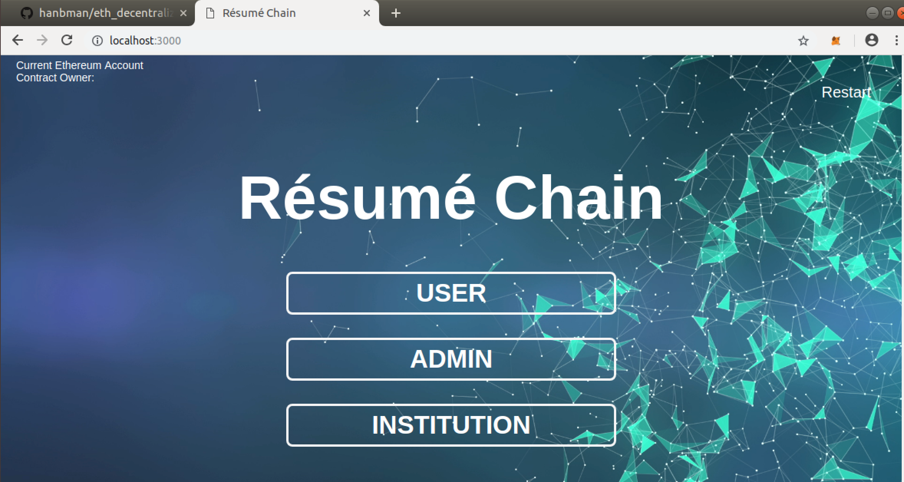
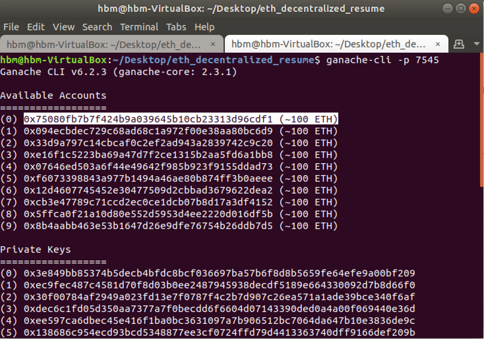

# Résumé Chain

## Ethereum Decentralized Resume DApp

### Introduction

There exists a challenge of keeping a verifiable, trustworthy record of an individual's past work and education history. With no central source of public record and an increasing number of unvetted institutions, there have been high profile cases of [public figures](https://www.businessinsider.com/melissa-howard-florida-gop-candidate-drops-out-over-fake-degree-2018-8) who have attempted to fabricate their work and education history. This project takes advantage of the immutable record and decentralized verification attributes of the ethereum blockchain to create a platform for individuals to create and maintain a lasting record which can be shared with guaranteed veracity.

### Components

The Resume.sol contract holds the primary logic of the decentralized resume platform. There are 4 main parties that interact on the contract:

1. Owner

The owner of the contract has the power to assign individuals as admins on the contract.

2. Admins

The admins are given the power to add vetted institutions to the platform. 

3. Institutions

The current platform supports 3 types of institutions:
    a. Universities
    b. Schools
    c. Certificators
These institutions are the ones who submit entries to users, giving them degrees or certificates to add to their resumes.

4. Users

The users on the platform are the ones who hold resumes.

### Functions and Interaction Logic

##### Owner

    addAdmin

- The contract owner can assign addresses as admins to oversee the platform and specifically add new institutions.

'''
isAdmin
'''

- This allows the contract owner to check if an address is indeed an approved admin

    setSignUpFee

- The contract owner has the ability to set the fee (in ether) required for new user to sign up. The default fee is 0.

##### Admins

    addInstitution

- The admins of the contract (including the owner) has the ability to assign addresses as institutions on the platform, able to give out degrees or certificates to users. This provides a layer of vetting so that only reputable institutions are allowed to give out degrees and this also prevents fraudulent copycat institutions.

##### Institutions

    addEntry

- Institutions are able to assign entries to users. Entries can either be a degree or a certificate and they include a number of fields including: address of the recipient, entry title such as "Bachelor of Science" or "PhD", degree description such as "Mechanical Engineering major with a specialization in nanotechnology", start date and end date which is the length of time the degree or certificate if valid for, entry type which is degree or certificate, and review which is a freeform review of the user.  

##### Users

    signUpUser

- Users are allowed to sign up themselves to the platform. They only need to provide a name and their address will be recorded as a unique user on the platform.

    checkQueueSize

- Users can quickly check if they have entries waiting in their queue and how large the queue has grown.

    showMyResumeQueue

- Once an institution creates an entry for a user, it is not automatically added to a user's resume. There is an intermediate staging step where the entry enters the resume queue of the user. The user is then able to check the queue and approve an entry. If they do not agree with a entry from an institution, this gives them a chance to review and discuss before it is added to their record permanently. This also gives an additional layer to guard against mistakes or fraudulent entries from institutions. Users are incentivized to add entries to their resume to build out their history. The function showMyResumeQueue let's the user see the next entry in their queue. The entry that is shown is the oldest entry in the queue based on FIFO principles. Since ethereum does not provide the ability to return entire dynamic arrays, this function only shows the next entry and requires the user to approve or reject before viewing the next entry. It is recommended that user start at this step and view their queues periodically to check if new entries require approval. Users need to record the entry number so that they can pass this to the approveEntry function to approve or reject the entry.

    approveEntry

- Once users view the next entry in their queue, they use this function to approve or reject the entry. They need to enter in the unique entryID that is associated with the next entry in their queue, along with a signal to approve or reject the entry. If approved, the entry will then be added permanently to the resume of the user, and if rejected, the entry will simple be removed from the user's resume queue.

    checkUserID

- This allows users to view their unique userID that exists on the platform that ties to their user address

    checkSignUpDate

- This allows users to see how long they have been on the platform

##### Third parties

    checkResumeSize

- This allows third parties to check how many entries are in a user's resume. This is a good first step before viewing a user's actual resume elements. Since the view resume function requires an input of the element of a user's resume to view, this function let's a third party see how much history a user has and choose the right element to view whether they want to see the oldest or earliest entry.

    viewResume

- This allows third parties to specify a userID and an element of their resume to view. For example, viewing element [0] of a resume is always the entry that was approved first by the user and conversely element [resumeLength-1] is the newest entry approved.

### Usage Guide

#### Required installations to run and test the contract

**Setting up the Environment**

The DApp was developed using these environment specifications:

- Ubuntu 18.04.1 LTS
- npm 3.5.2
- node.js 8.10.0
- lite-server 2.4.0
- truffle 5.0.1
- solidity 0.5.0
- Ganache-CLI 6.2.3

To make sure that there are no issues with dependencies, we recommend that you run everything from a virtual machine. These are the instructions on how to set up VirtualBox on your machine to install Ubuntu.

*Oracle VM VirtualBox*

VirtualBox is a general-purpose full virtualizer for x86 hardware, targeted at server, desktop and embedded use. It allows us to create a virtual desktop environment on existing hardware. This enables us to run the same software even if we are running different operating systems, which helps reduce problems associated with different development environments.

Many of the tools we are using throughout the course are under active development and encountering bugs is a common occurrence. Additionally, different versions of the tools we will be using (Windows vs Mac vs Linux) may show different errors and complicate the learning process. To avoid these problems, we encourage everyone to use VirtualBox running the latest version of Ubuntu. Ubuntu is a free open source distribution of the Linux operating system.  

Please download [VirtualBox for your machine here](https://www.virtualbox.org/wiki/Downloads).

You can download the [latest version of Ubuntu Desktop here]("https://www.ubuntu.com/download/desktop").

There is a good tutorial on [how to install Ubuntu on VirtualBox here]("https://askubuntu.com/questions/142549/how-to-install-ubuntu-on-virtualbox"). A VM with 4GB RAM and 10GB of storage should be sufficient for the purposes of this course. Also, setting up a shared folder between the virtual machine and your host machine is not strictly necessary, but it is convenient if you want to write code on your host machine and run it on the virtual machine.

Make sure that these following packages are installed:

1. [Truffle](https://truffleframework.com/docs/truffle/getting-started/installation)
2. [Ganache](https://truffleframework.com/docs/ganache/quickstart)
3. [NPM](https://www.npmjs.com/get-npm)
4. [Lite-Server](https://www.npmjs.com/package/lite-server)
5. [MetaMask](https://metamask.io/)

This project was developed in an ubuntu64 environment.

**To run package:**

The ethereum decentralized resume is a truffle project that contains the required contract, migration and test files to run a DApp. 

Use git to clone this repo to your local machine:

1. Grab the link from the git repo in the top right hand corner under "Clone or download"

2. From the command line, navigate to your folder of choice and run 

*git clone "repo link"*

**Truffle Compile, Migrate, Test:**

To run truffle compile, migrate, and test, first go into the local folder where the repo has been cloned. Start ganache-cli from the command line in that directory with the command:

    *ganache-cli -p 7545*

This creates a development blockchain with 10 prefunded accounts so that testing can occur. Default port is 8545 but we are going to launch in the 7545 port which is what the flag in the command is for. This port is where the chain is running and also where truffle looks when running migration and tests.

In the same directory, run the command:

    *truffle compile*

This compiles the contract code and creates an ABI that helps the contract get deployed onto the blockchain.

Then, in the same directory, run the command:

    *truffle migrate*

This migrates our contract, it's dependencies, and other artifacts on the blockchain of our choice. Since we are only testing here, this migrates onto the ganache cli test chain.

    *truffle test*

Tests are written in javascript to test the functionality of the contract. This function shows the results from running tests on the ganache test chain.

**Tests**

The following tests are included in this package:

1. Admin Sign Up- Owner of the contract should be able to sign up admins, and verify who is an admin.
2. Institution Sign Up - Admins should be able to add institutions.
3. User Sign Up - Owner should be able to set the sign up fee. User should be able to sign up.
4. Add Entry - Institution should be able to add entry to user's queue. User should be able to view queue.
5. Confirm Entry - Users should be able to confirm entries in their queue into their resume.
6. View Resume - Outside parties should be able to view user's resume.

**Libraries**

Standard libraries were found in the [Consensys repo](https://github.com/ConsenSys/ethereum-developer-tools-list). The following libraries are included in this package:

1. SafeMath - Allows numerical operations to be done safely preventing integer overflow, etc.
2. Math - contains additional mathematical operations
3. BokkyPooBahsDateTimeLibrary - helps with datetime processing such as converting between unix timestamp and human readable datetime
4. Ownable - In addition, the resume contract inherits from the Ownable contract. Although not a library, ownable contains functionality to help deal with contract ownership and ownership mutability.

**Frontend:**

We recommend that you have google chrome along with the [MetaMask](https://metamask.io/) Chrome plugin installed in your ubuntu environment when running this frontend.

To access the front-end user interface for the contract via Web3, you must run a development server. Navigate to the local project folder in the command line.

If you haven't already done so, install lite-server locally into the project folder. Navigate to the folder eth_decentralized_resume, where you git cloned the project.

Run the command npm install 
    
    *lite-server --save-dev* 
    
(more information [here]("https://www.npmjs.com/package/lite-server"))

Step 1: Start the development server and launch the frontend:

From the command line, in the project folder, run this 

    command- *npm run dev*

This will launch the frontend in the Chrome browser with localhost:3000

Step 2: Run the ganache cli:

Open a new tab in your command line window in the same project folder directory and run this command:

    *ganache-cli -p 7545*

This starts the ganache test chain so that it is active for port 7545. The frontend is served through port 7545 so our ganache needs to be aligned.

That will start the frontend in a browser window with a local address. To interact with the contract through the browser, the metamask plug in must be set up. In order to import users from the ganache test environment, grab one of the private keys for an account generated by ganache. This can be found at the terminal window where ganache was launched.

The first account, account[0] is the account used to launch the contract and that is the contract owner. You will need to grab 3 other account private keys so that you can load those into metamask and test the different functionalities of the front end.

Go into Metamask and set the connection to "Custom RPC" and the target RPC url to http://127.0.0.1:7545. This connects the Ganache chain with metamask so accounts from ganache can be used through metamask. To import an account from ganache onto MetaMask, choose Create Account from the drop down in MetaMask and enter in the private key. Now you are free to interact with the DApp using MetaMask via the ganache test network!

This frontend has the 3 main contract functionalities incorporated. 

1. First, you can sign up as a user on this Dapp. Use one of the accounts other than the contract owner. Click on the USER button and in the drop down, type in your name in the "Username" field. Click the Sign Up button and you will be added to the contract as a user. MetaMask should prompt you to approve a transaction. That is basically paying a nominal fee for the transaction to happen to run the function necessary to sign up the user.

2. As a contract owner, you can also sign up other accounts as Admins on the contract. Go to metamask and change the identity to the owner's account. Then copy the address for another account and enter in that value in the "Admin Address" field. Click sign up. Now that account has been given Admin rights.

3. Admins (including the owner) have the power to add institutions. Institutions are either universities, schools, or certificators who can add entries to the resume of the users. Add the "Institution Name," "Institution Address," and "Type" to sign up a verified institution.